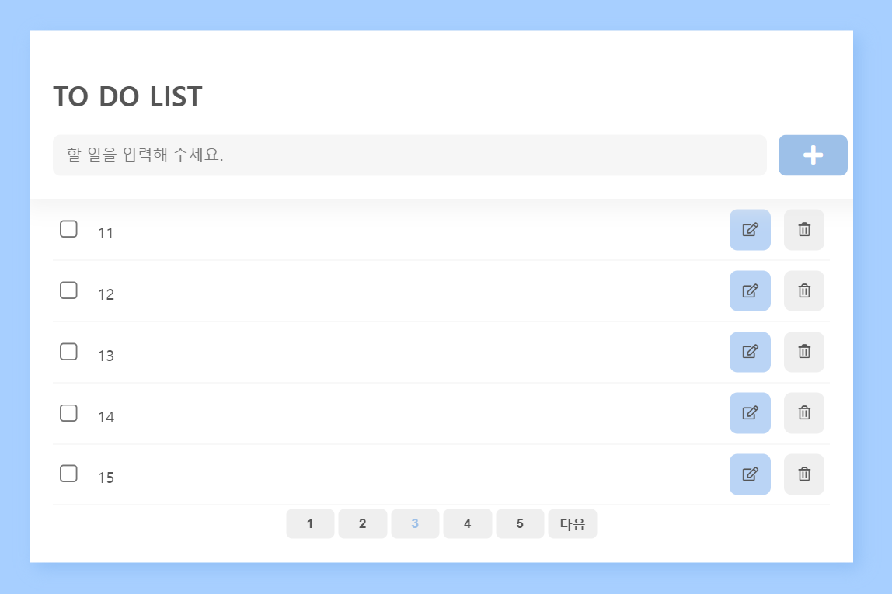
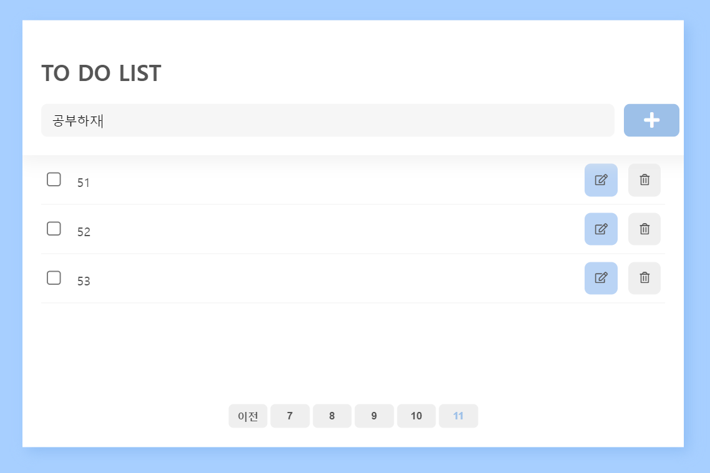
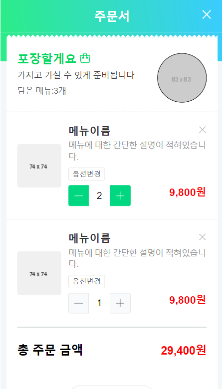

# cloneCoding 결과물
## toDoList
### pagenation,fetch,json-server활용

## naverOrder
### 각종 html,scss&css 기술 알아보기

## 숫자야구

# toyProject
## schoolSeatData 크롤링
### 학교도서관 좌석정보 크롤링 후 좌석사용여부 건네주기

# poimaWeb정리
[JavaScript](https://github.com/youngduck/WebStudy/blob/main/poimaweb/javascript/README.md)