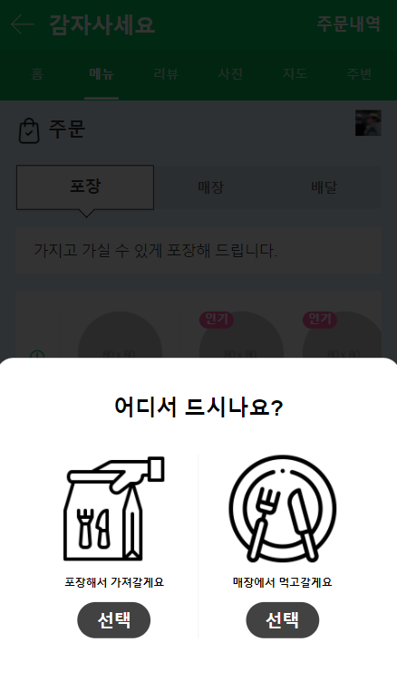

# cloneCoding 결과물
## toDoList
### pagenation,fetch,json-server활용

## naverOrder
### 각종 html,scss&css 기술 알아보기

# poimaWeb정리
[JavaScript](https://github.com/youngduck/WebStudy/blob/main/poimaweb/javascript/README.md)