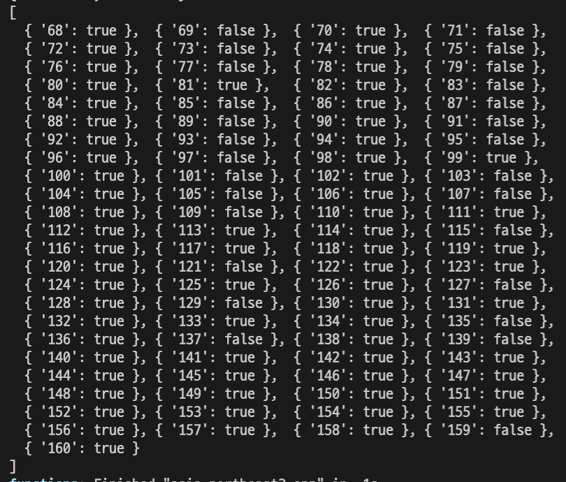

# cloneCoding 결과물
## toDoList
### pagenation,fetch,json-server활용

## naverOrder
### html,scss&css 활용한 마크업

## 숫자야구

## 드럼만들기
### 키값에따른 반응형 웹

## 스로틀을활용한 프로그레스바

## fetchAPI,pagenation 활용 무한스크롤 웹

## 캐러셀

## 유튜브

## html게임(snake)
### canvas,정규표현식,localStorage 활용

## 모달팝업

# toyProject
## schoolSeatData 크롤링
### 학교도서관 좌석정보 크롤링 후 좌석사용여부 건네주기

# poimaWeb정리
[JavaScript](https://github.com/youngduck/WebStudy/blob/main/poimaweb/javascript/README.md)